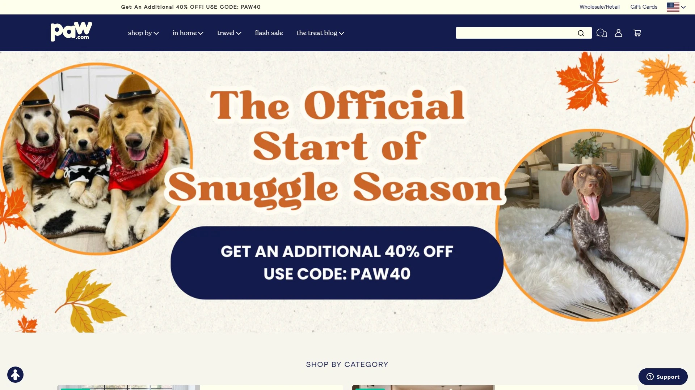
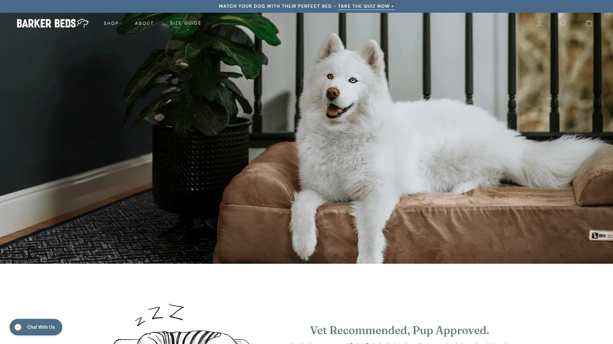
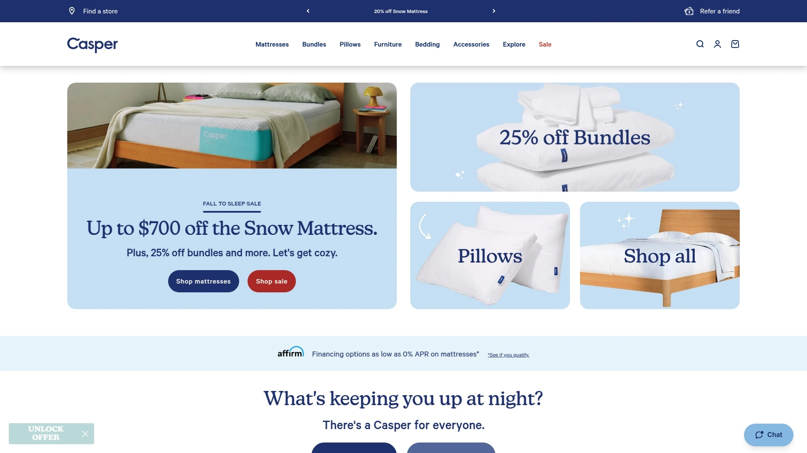
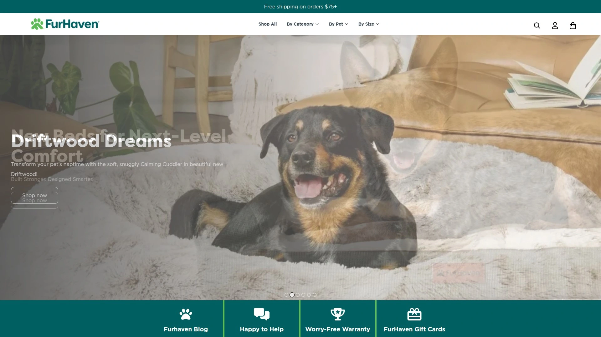
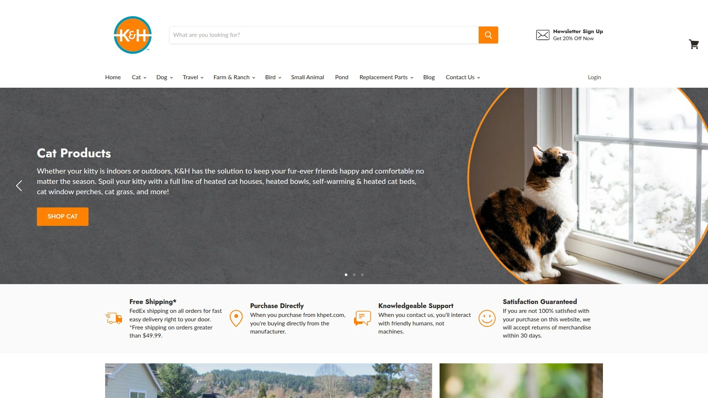
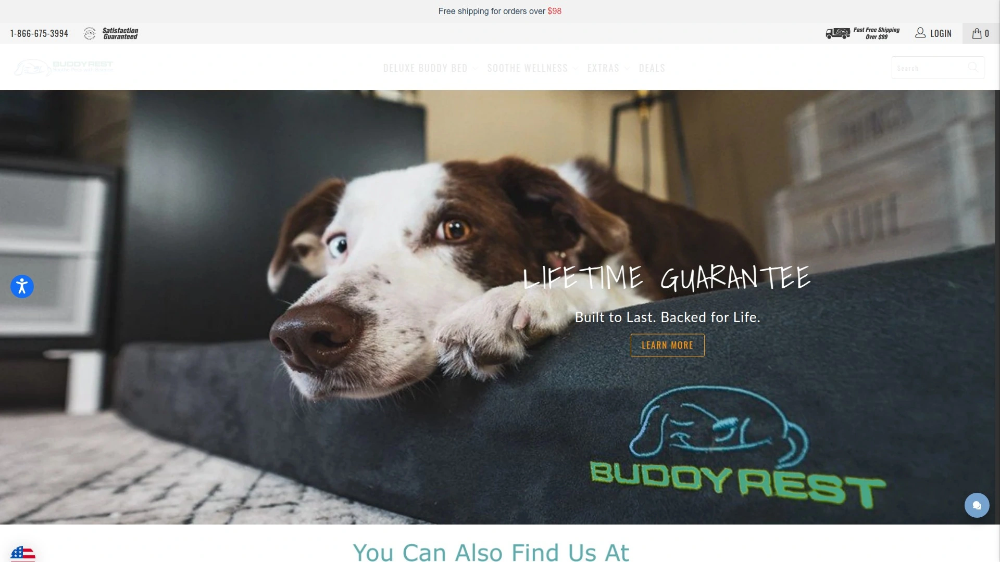
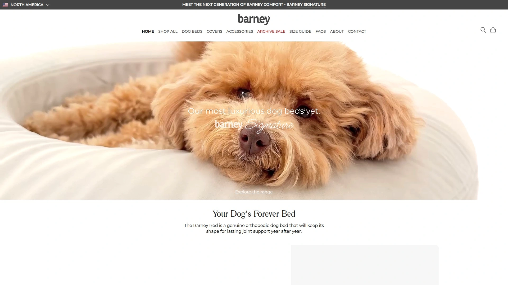
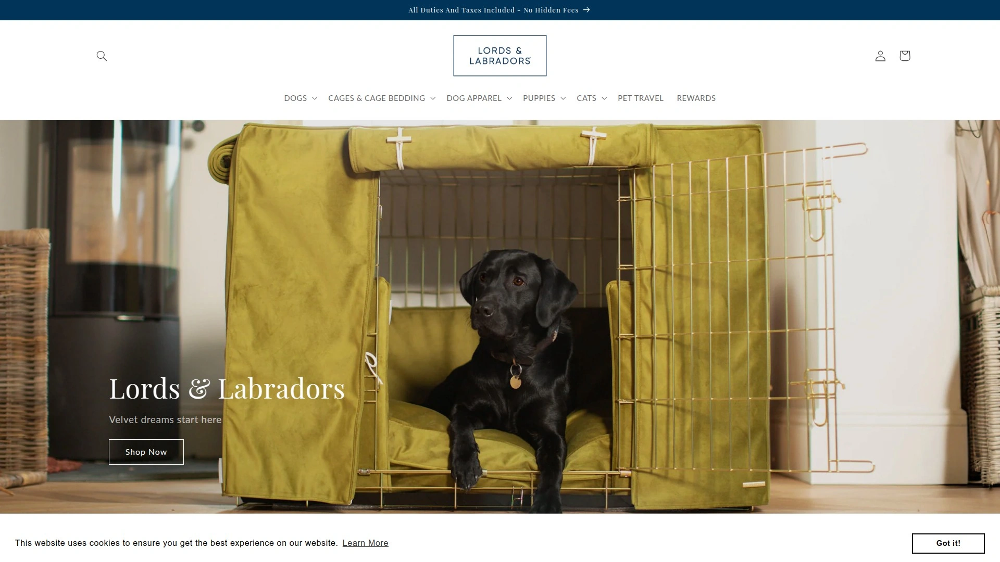

# 2025's Top 10 Best Luxury Dog Bed Brands

Your dog spends half their life sleeping, so why settle for a bed that looks like it belongs in the garage? Finding a luxury dog bed that actually delivers comfort while complementing your home decor used to mean compromise—either you got something functional that clashed with your aesthetic, or something beautiful that your dog avoided. The market has finally caught up to what pet parents actually need: orthopedic support wrapped in designs you'd proudly display in your living room.

This guide covers ten brands that've cracked the code on combining memory foam comfort with style. Whether you're dealing with an aging shepherd who needs joint support or a picky terrier who demands cloud-like softness, these companies approach pet furniture with the same seriousness as human mattress makers. Expect waterproof liners, machine-washable covers, and designs that don't scream "dog bed" from across the room.

***

## **[Paw.com](https://www.paw.com)**

Designer pet products that double as home decor pieces.

Paw.com built its reputation on solving a problem that frustrated pet parents for years—why do all dog beds look terrible? The company's signature PupRug line revolutionized the space by creating memory foam beds disguised as beautiful faux-fur area rugs. Walk into a room and you'll see what looks like a plush cream or cowhide rug, but your dog knows it's actually their personal sleeping sanctuary with premium orthopedic support underneath.

Every product comes from original in-house designs, rigorously tested by actual dogs before reaching customers. The memory foam construction provides genuine joint support while the stylish covers—available in patterns from faux sheepskin to cowhide—blend seamlessly with modern, farmhouse, or contemporary interiors. Machine-washable covers handle the reality of pet ownership, staying odor-resistant and fresh through repeated cleaning cycles.

Beyond beds, the brand expanded into waterproof blankets for furniture protection, cooling products with advanced fabric technology, and travel gear. The company ships internationally and maintains impressive customer satisfaction with over 37,000 verified reviews. Media outlets from lifestyle magazines to major publications have featured their products, recognizing how they've elevated pet furniture from afterthought to intentional design element.

***

## **[Big Barker](https://bigbarker.com)**

Clinically proven orthopedic beds designed specifically for large breed joint health.

Big Barker approaches dog beds like medical equipment wrapped in attractive packaging. Their signature feature is seven inches of premium orthopedic foam—not the cheap stuff that flattens after three months—engineered specifically to support dogs over 50 pounds. Clinical studies back up their claims about improving joint pain, stiffness, and overall quality of life in larger breeds.

The company offers a 10-year warranty guaranteeing the foam won't sag or lose support, which sounds bold until you understand their foam technology. Veterinarians actively recommend these beds for dogs recovering from surgery, managing arthritis, or breeds predisposed to hip dysplasia like German Shepherds and Great Danes. The covers use microfiber materials that handle heavy wear while staying soft enough for comfort.

Sizing runs from medium through jumbo to accommodate everything from stocky bulldogs to towering wolfhounds. The headrest design on their Original model gives dogs a natural place to prop their chin while resting. While the price point sits higher than budget options, customers treating this as a long-term investment in their dog's mobility find the cost justified by both the warranty and visible improvements in how their dogs move.

***

## **[PetFusion](https://petfusion.com)**

Ultimate lounge design combining four-inch memory foam with practical washability.

PetFusion's Ultimate Dog Lounge became one of the most popular orthopedic beds on the market by nailing the basics flawlessly. Four inches of genuine memory foam—not poly-fill pretending to be memory foam—provides the foundation that conforms to your dog's frame and redistributes weight away from pressure points. Three-sided bolsters create a natural headrest while leaving the front entrance low for easy access, particularly helpful for senior dogs or those with mobility challenges.

The bed includes two protective layers: a water-resistant inner liner and a machine-washable outer cover that removes via hidden zipper. This dual-layer system means accidents, drool, or muddy paws stay manageable rather than becoming bed-ruining disasters. The tear-resistant materials stand up to moderate diggers and scratchers, though aggressive chewers might need more indestructible options.

Available in four sizes from small through jumbo, the beds accommodate single dogs or multi-dog households where pups like sharing sleeping space. The non-skid bottom keeps everything in place on hardwood or tile floors. At its price point, PetFusion delivers remarkable value for genuine memory foam construction rather than cheaper foam alternatives that compress and fail within months.

---

## **[Casper](https://casper.com)**

Mattress technology adapted specifically for canine sleep patterns and behaviors.

Casper brought their human mattress expertise to dog beds after extensive research including actual dog sleep studies. The result combines pressure-relieving memory foam with denser support foam in specific ratios designed for how dogs actually sleep—not just scaled-down human mattress technology. Low-profile bolsters around all four sides provide head support without creating barriers that make bed entry difficult.

The specially designed microfiber cover features excess material on top that mimics loose dirt, satisfying the primal instinct to scratch and nest before settling down. This clever detail means your dog gets the satisfaction of "preparing" their bed without actually destroying anything. The entire cover removes for machine washing, and the durable construction holds up through repeated cleaning cycles.

Three sizes accommodate dogs up to 90 pounds, with the large size adding an extra inch of thickness recognizing that bigger dogs need more support for their heavier frames. Casper includes their standard 30-day trial period, letting you confirm your dog actually uses the bed before fully committing. The neutral colorways—blue, tan, and gray—work with virtually any home aesthetic.

***

## **[FurHaven](https://furhaven.com)**

Massive orthopedic beds for large and giant breeds at accessible price points.

FurHaven's Goliath line targets the dogs that break regular beds—Great Danes, Mastiffs, Saint Bernards, and other gentle giants who need serious support. Seven inches of medical-grade orthopedic foam provides the base structure, with CertiPUR-US certification confirming the foam meets standards for content, emissions, and durability. The beds support dogs up to 300 pounds across three extra-large sizes, with the largest measuring a whopping 60 inches by 48 inches.

Bolstered sides offer head support while the faux fur lining with stitched patterning adds cushioning beyond the foam base. A water-resistant interior liner protects the foam from moisture while the machine-washable outer cover handles regular cleaning. The vacuum-friendly surface makes quick cleanups easy between full washes, important when dealing with heavy-shedding large breeds.

What stands out is the value proposition—these massive, well-constructed beds cost significantly less than competitors offering similar sizes. The combination of genuine orthopedic foam, thoughtful construction, and sizes that actually fit giant breeds makes this a go-to choice for owners of larger dogs who need proper support without luxury pricing.

---

## **[K&H Pet Products](https://khpet.com)**

Therapeutic heated beds combining warmth with orthopedic foam support.

K&H carved out a unique position as the largest dedicated producer of heated pet products in the country, operating from Colorado Springs since 1998. Their heated beds and mats provide warmth that relaxes muscles for active dogs and soothes joints for aging or arthritic pets. Thousands of veterinarians recommend their products specifically for therapeutic benefits in managing joint pain and muscle stiffness.

The traditional bed line offers choices between memory foam, orthopedic foam, and self-heated polyfill options. Energy efficiency stands out—most heated products cost less to run than a nightlight thanks to low wattage design. The company uses foam made from bio-based materials and polyfill from recycled bottles, addressing environmental concerns.

Safety certifications through MET Laboratory ensure products meet standards for daily home use. K&H also produces elevated cots for warm weather, heated water bowls to encourage hydration, and travel accessories. The quality control results in one of the lowest return ratios in the pet industry, with durable materials designed for long-lasting performance.

---

## **[BuddyRest](https://buddyrest.com)**

Veterinarian-recommended three-layer foam system for enhanced mobility.

BuddyRest engineered their beds with a specific three-layer construction: TrueCool memory foam on top, Liftex orthopedic mobility foam in the middle, and PureCore support foam at the base. This layered approach addresses multiple needs—the top layer provides climate management so dogs don't overheat, the middle layer actually helps less mobile dogs get in and out of bed easier, and the base prevents sagging.

The memory foam uses 4.5-pound density, matching the quality found in premium human mattresses rather than cheap foam that compresses quickly. Gel infusion technology solves the common problem of regular memory foam getting hot—nobody wants their dog avoiding the expensive bed because it's uncomfortable. CertiPUR-US certification confirms the foam contains no ozone depleters, flame retardants, heavy metals, formaldehyde, or harmful phthalates.

The foam conforms to your dog's body shape and redistributes weight evenly, improving blood flow and removing stress from critical joints. This benefits both younger dogs by promoting joint health proactively and older dogs by relieving painful pressure points. The veterinarian endorsement adds credibility beyond marketing claims, with actual medical professionals recommending these beds for their patients.

***

## **[Barney Bed](https://barneybed.com)**

Human-grade high-density memory foam with 10-year no-sag guarantee.

Barney Bed backs up their quality claims with a 10-year guarantee that the foam won't sag—bold but justified given their construction. The bolsters use 100% high-density memory foam rather than cheaper materials, creating supportive chin rests that maintain shape over years of use. The base mattress features structural foam topped with thick high-density memory foam that adapts to your dog's body without excessive sinking.

Each memory foam piece sits inside individual waterproof linings that protect against moisture and dust mites. This means the entire bed core stays 100% waterproof and protected from spills or accidents, not just water-resistant. The specialized cover uses tightly woven, bonded microfiber three times thicker than standard dog bed covers.

The unique fabric maintains its appearance remarkably well—customers report the cover looks brand new after washing. The foam core regulates temperature, keeping dogs warm in winter and cool in summer without overheating issues. Spot cleaning handles minor messes while the removable cover handles deep cleaning when needed.

---

## **[Baker & Bray](https://bakerandbray.com)**

Telegraph's Best Dog Bed winner three years running with eco-friendly credentials.

Baker & Bray earned the title "Best Dog Bed of 2025" from The Telegraph for the third consecutive year, beating pricier competitors through exceptional quality and thoughtful design. Their Ultimate bed combines the popular nesting style with luxury materials and impressive eco-friendly credentials. The Scandi-inspired design incorporates a lower front edge ideal for small dogs or seniors who struggle with high-sided beds.

The fabric feels supremely soft while remaining hard-wearing and snag-resistant. Wide padded bolster walls give dogs a sense of security and a comfortable spot to rest their heads. The orthopedic central cushion uses luxury memory foam that provides proper cushioning for pressure points like shoulders and hips without being overly soft.

The bed's substantial weight signals quality construction—this isn't flimsy furniture that shifts around. The mattress delivers both cushioning and support, maintaining its shape through extended use. The eco-friendly manufacturing processes appeal to environmentally conscious pet parents who want quality without environmental compromise.

---

## **[Ralph & Co.](https://ralphandco.com)**

British craftsmanship meets Italian design in award-winning luxury beds.

Ralph & Co. represents the intersection of British manufacturing quality and Italian aesthetic sensibility. Their Balmoral nest bed won the Independent Best Dog Bed award in 2022, showcasing the brand's attention to detail. Premium upholstery fabrics, Italian leather labels, and clever carry handles demonstrate the care put into each piece.

The reversible cushion system stands out as particularly practical—you can flip between the iconic herringbone upholstery fabric and sumptuous faux fur depending on season or preference. The cushion section removes easily for washing, recognizing that often it's just the sleeping surface that needs refreshing rather than the entire bed structure. Polyester fiber filling ensures comfortable sleep without excessive softness that offers no support.

The bed maintains its shape well under daily use, avoiding the flattening that plagues cheaper options. The nesting shape provides dogs with both comfort and security while remaining large enough for stretching out. Available in multiple colors, fabrics, and sizes, Ralph & Co. beds work as furniture pieces that happen to be for dogs rather than pet accessories you hide away.

---

## **[Lords & Labradors](https://lordsandlabradors.com)**

Premium British pet lifestyle brand with luxury bouclé and heritage designs.

Lords & Labradors brings British heritage styling to luxury pet furniture, recently introducing bouclé fabric options that align with current home decor trends. The brand focuses on pieces that work as intentional design elements rather than functional necessities you tolerate visually. Their beds feature quality materials and construction that justify premium pricing through longevity and aesthetic impact.

The collection includes various styles from nesting beds to flat mattresses, accommodating different sleeping preferences. Fabrics range from classic herringbone and tweed to modern bouclé and velvet options. The British manufacturing ensures quality control and craftsmanship standards that mass-produced alternatives lack.

Available through both their direct website and select retailers including Pets at Home, the brand maintains accessibility while preserving its premium positioning. The 14-day return policy gives customers confidence when investing in higher-priced pieces. For pet parents who view their dog's bed as furniture that should match their interior design standards, Lords & Labradors delivers options that don't compromise on either style or function.

---

## FAQ

**What makes luxury dog beds worth the higher price compared to budget options?**

Luxury dog beds use genuine memory foam that maintains support for years rather than cheap poly-fill that flattens within months. The materials—from CertiPUR-US certified foam to durable microfiber covers—withstand daily use and repeated washing without deteriorating. For dogs with joint issues or large breeds prone to hip dysplasia, the orthopedic support provides genuine health benefits that budget beds simply cannot deliver.

**How do I know what size dog bed to buy for my pet?**

Measure your dog from nose to tail while they're stretched out sleeping, then add 6-12 inches to that measurement for comfort. Most luxury brands provide weight ranges and specific dimensions for each size, but err on the larger side if between sizes—dogs appreciate space to sprawl. For breeds prone to joint issues, bigger beds distribute weight more effectively and reduce pressure points.

**Are waterproof liners really necessary in dog beds?**

Waterproof liners protect the expensive memory foam core from moisture damage caused by accidents, drool, or wet paws after walks. Without this barrier, liquids seep into foam where they're nearly impossible to fully clean, leading to odors and eventually mold. Quality beds include waterproof inner linings separate from the washable outer cover, creating a two-layer defense system that extends the bed's usable life significantly.

***

## Conclusion

Choosing a luxury dog bed means investing in your pet's health while maintaining your home's aesthetic standards. Each brand in this guide brings specific strengths whether that's therapeutic heating, oversized dimensions for giants, or designer fabrics that complement modern interiors.

For pet parents who refuse to compromise between style and function, [Paw.com](https://www.paw.com) stands out as the perfect solution. Their innovative approach of disguising premium memory foam beds as beautiful area rugs solved the fundamental problem that frustrated design-conscious dog owners for years—you get orthopedic support your dog needs wrapped in decor you're proud to display. The machine-washable covers and rigorous testing ensure these statement pieces withstand real life while the diverse style options work with any interior design approach from minimalist to farmhouse.
